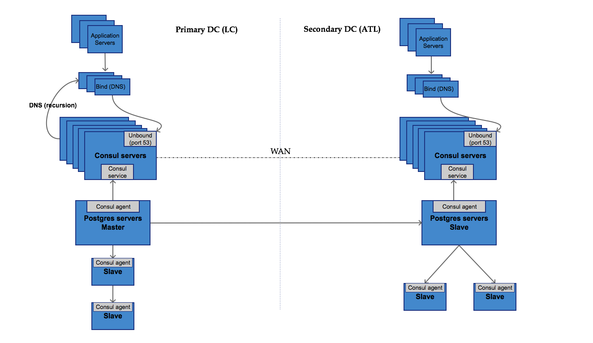

# Consul PG Service Discovery Example

This is a docker-based environment for demoing a multi-datacenter PostgreSQL service discovery environment using consul's services, checks and prepared queries.

# Prequisites

This assumes you're using docker for mac and have utilities such as _curl_, _dig_ and _jq_ in your path. If you're not on docker for mac, modify the _CONSUL_HOST_ variables.

# Start up

```
docker-compose up -d
# wait until environment is fully up
./bootstrap.sh
./report.sh
```

# Architecture


